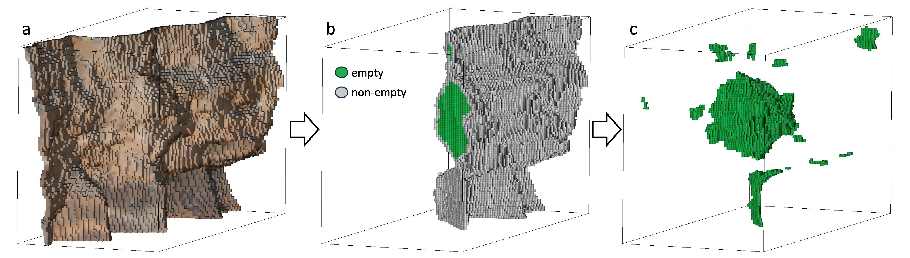
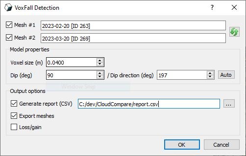

<table>
<tr>
<td width="25%" align="center">

</td>
<td width="75%" align="left">
<h1>Welcome to VoxFall</h1>
<p>The official repository for:<br><a href="https://doi.org/10.1016/j.enggeo.2025.108045"><em>VoxFall: Non-Parametric Volumetric Change Detection for Rockfalls 📚 </em></a><br><a href="https://doi.org/10.1016/j.enggeo.2025.108045"></a></p>
<a href="https://www.cloudcompare.org/"></a> <a href="https://pypi.org/project/pyvoxfall/"></a> <a href="https://cplusplus.com/"></a> <a href="https://github.com/pre-commit/pre-commit"></a> <a href="https://opensource.org/license/mit"></a>
</td>
</tr>
</table>

**If you ❤️ or simply use this project, don't forget to give the repository a ⭐,
it means a lot to us !**
<br>

## 📌 Description
**VoxFall (Volumetric rockFall)** is an open-source software for automatical detection and quantification of rockfall events as discrete blocks directly between two 3D models.
<br>
VoxFall does not rely on any distance computation between two models while is free from scale parameters associated to normals, spatial clustering, and cluster shape reconstruction.
<br>
The method treats the two input models as a single scene and applies two steps: 1) fitting an occupancy voxel grid of a resolution defined by the registration error; 2) empty space clustering and volume computation based on voxel adjacency. 

<p align="center">
  
</p>

<br>

## 💻 Usage
VoxFall is freely available in 2 ways:
1. As a CloudCompare plugin (**Windows and Linux**)
2. As a Python package (**In Windows, Linux and macOS**)
 
### 1. CloudCompare plugin
VoxFall is available in Windows as a **plugin in CloudCompare (2.14+)** 
Simply install the latest version of [CloudCompare](https://www.danielgm.net/cc/release/) and in the menu bar navigate to:
<br>
**Plugins** → **VoxFall**
<br>

Running the plugin will open VoxFall's graphical user interface (GUI).
<p align="center">
  
</p>

For detailed instructions on how to use the VoxFall plugin, please refer to the [official documentation on the CloudCompare wiki](https://www.cloudcompare.org/doc/wiki/index.php/VoxFall_(plugin)).

### 2. Python package (pyvoxfall)

⏳ **Coming Soon** - The Python package is currently under development and will be available shortly. Stay tuned for updates!

<!-- **pyvoxfall** and its dependencies may be installed and launched **in any OS (Windows, Linux and macOS)** as a Python package:

```console
python -m pip install pyvoxfall
``` -->
<br>

## 📖 Citing VoxFall

If you use VoxFall in your research, please cite the following paper:

### APA Citation
```
Farmakis, I., Guccione, D. E., Thoeni, K., & Giacomini, A. (2025). VoxFall: Non-parametric volumetric change detection for rockfalls. Engineering Geology, 352, 108045. https://doi.org/10.1016/j.enggeo.2025.108045
```

### BibTeX Citation
```bibtex
@article{Farmakis2025,
  author = {Farmakis, Ioannis and Guccione, Davide Ettore and Thoeni, Klaus and Giacomini, Anna},
  title = {VoxFall: Non-parametric volumetric change detection for rockfalls},
  journal = {Engineering Geology},
  volume = {352},
  year = {2025},
  pages = {108045},
  issn = {0013-7952},
  doi = {10.1016/j.enggeo.2025.108045},
  url = {https://www.sciencedirect.com/science/article/pii/S0013795225001413}
}
```

### Chicago Citation
```
Farmakis, Ioannis, Davide Ettore Guccione, Klaus Thoeni, and Anna Giacomini. "VoxFall: Non-parametric volumetric change detection for rockfalls." Engineering Geology 352 (2025): 108045. https://doi.org/10.1016/j.enggeo.2025.108045
```

Thank you for citing VoxFall in your work! Your citations help to support the continued development and maintenance of this software.

<br>

## Acknowledgements

<table>
<tr>
<td width="25%" align="center">

</td>
<td width="75%" align="left">
VoxFall has been developed at the Research Centre for Geotechnical Science and Engineering of The University of Newcastle (Australia).<br><br>Funding provided by the Australian Research Council (DP210101122):<br><br><em>'Efficient geotechnical risk management of rock cliffs'</em><br><br>and the Australian Coal Association Research Program (ACARP C33040):<br><br><em>'Application and Validation of Machine Learning for Rockfall Analysis'</em>
</td>
</tr>
</table>